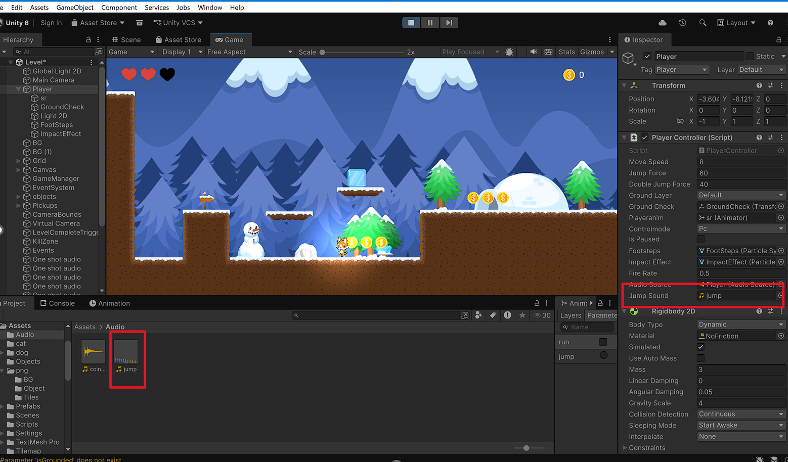
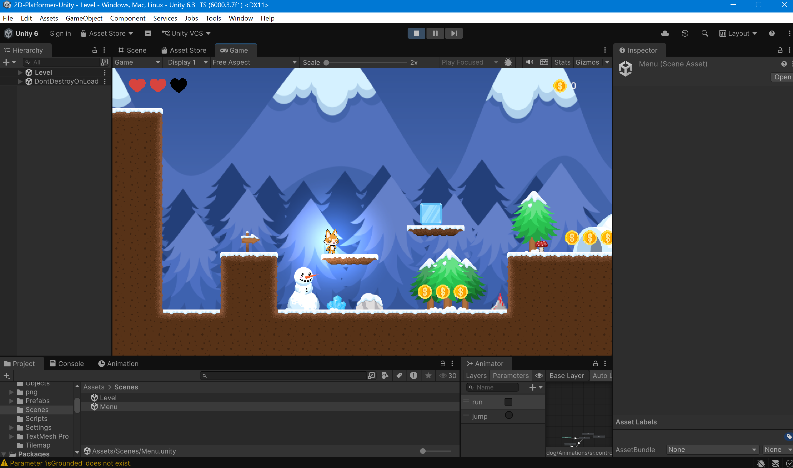
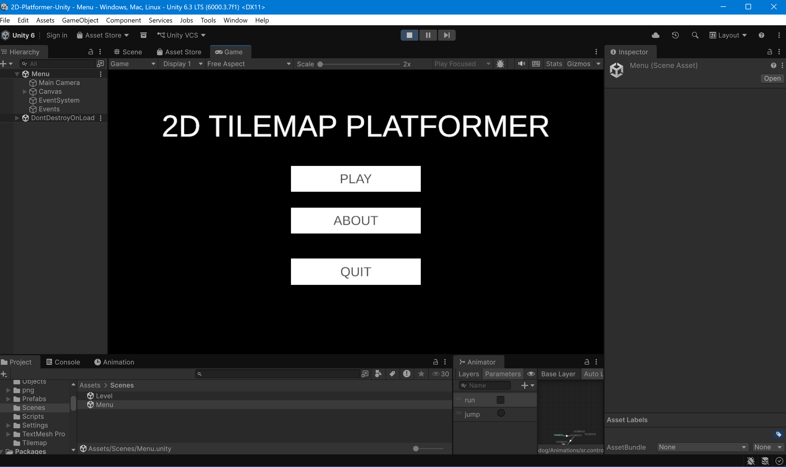
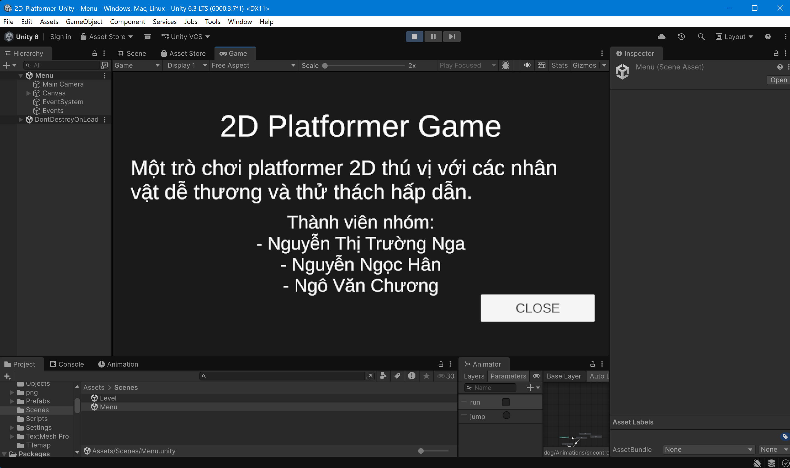

# LAB 04: PHÂN TÍCH VÀ MỞ RỘNG DỰ ÁN 2D-PLATFORMER-UNITY

## ## Thông tin sinh viên
- **Họ tên**: Nguyễn Thị Trường Nga
- **MSSV**: 2312697
- **Lớp**: CTK47A

## ## Mô tả
Bài thực hành Lab 04 môn **Game 2D Development with Unity**.
PHÂN TÍCH VÀ MỞ RỘNG DỰ ÁN 2D-PLATFORMER-UNITY

## ## Các thay đổi đã thực hiện
- Bổ sung các hiệu ứng âm thanh phù hợp: nhặt vật phẩm, chiến thắng,...  

- Bổ sung cơ chế bẫy, kẻ thù  

- Tuỳ chỉnh UI, xây dựng thêm menu About, khi người dùng click vào menu About, hệ thống hiển thị thông tin bao gồm: Tên Game, Mô tả ngắn, Danh sách thành viên nhóm

## ## Kiến thức đã học được
1. Biết cách clone và mở một dự án Unity từ GitHub.
2. Hiểu cấu trúc thư mục của một dự án Game 2D.
3. Cách chỉnh sửa các thông số trong Canvas của Unity.
4. Cách quản lý phiên bản và commit thay đổi bằng Git.
5. Sử dụng Markdown để viết báo cáo chuyên nghiệp.

